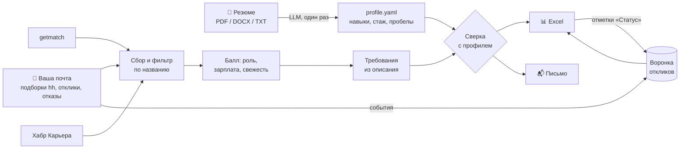

<p align="center">
  
</p>

<p align="center">
  <a href="https://github.com/pavelaleks80/JobHunter/actions/workflows/ci.yml"></a>
  
  <a href="LICENSE"></a>
  
</p>

<p align="center">
  <b>Каждое утро — все подходящие вакансии с getmatch, Хабр Карьеры и hh.ru в одном письме,<br>
  с ответом на главный вопрос: <i>«подхожу ли я сюда и чего мне не хватает?»</i></b>
</p>

---

## Зачем

Когда ищешь работу, каждый день уходит час на одно и то же: открыть три сайта, пролистать сотню вакансий,
прочитать требования, вспомнить, куда уже откликался. JobHunter делает это за вас:

- 🔎 **собирает** вакансии с [getmatch](https://getmatch.ru), [Хабр Карьеры](https://career.habr.com) и из подборок
  [hh.ru](https://hh.ru), которые приходят вам на почту;
- 🎯 **отбирает** «свои» по названию и оценивает: роль, зарплата на руки, свежесть, ключевые слова, целевые компании;
- 📄 **сверяет требования с резюме** — по каждой вакансии видно, какие пункты закрыты опытом, какие нет и что
  стоит дописать в резюме;
- 📬 **присылает письмо** со всеми подходящими вакансиями без вашего отклика; новые помечены 🆕;
- 📊 **ведёт воронку откликов почти без ручного труда**: отклики Хабра, отказы и ответы работодателей с hh
  попадают в трекер из писем площадок автоматически;
- ✉️ **пишет черновики сопроводительных писем** под конкретную вакансию — только по фактам из вашего резюме;
- 🧹 **склеивает дубли**: одна вакансия с трёх площадок — одна строка в отчёте;
- 💰 **считает зарплаты** по вашим ролям: медиана, разброс, динамика по неделям и сколько вакансий дают вашу цель.

## Как это выглядит

```
Тема: Вакансии: 30 подходящих, из них новых 7 (08.10.2026)

 Соотв.    Вакансия                                     Зарплата            Не хватает / дописать в резюме
 100%      🆕 Руководитель проектов внедрения ERP       от 300 000 на руки  —
 Подходит     Завод «Пример» · Хабр · балл 88
  83%      Delivery Manager                             не указана          частично: SQL на уровне выборок
 Подходит     ТехКомпания · getmatch · балл 74                              Дописать в резюме: ChatGPT в работе
  60%      Product Owner (B2B-платформа)                250–320 тыс.        нужно от 3 лет, у кандидата ~2
 Частично     Банк · getmatch · балл 61
 ...
 Воронка: откликов 42 — ответили 9, приглашений 4, отказов 15; медиана ответа 3 дн.
```

Во вложении — Excel: «К отклику», «Все», **«Пробелы резюме»** (какие требования чаще всего не закрыты — что подтянуть
или дописать), **«Зарплаты»**, «Воронка», «Источники».

## Как это работает



1. **Профиль.** Вы кладёте резюме в `workspace/resume/`, команда `jobhunter profile` через любую LLM с
   OpenAI-совместимым API (OpenRouter, DeepSeek, OpenAI…) превращает его в `profile.yaml`: навыки с доказательствами,
   стаж по областям, уровень английского и то, чего у вас нет. Это черновик — его можно и нужно поправить руками.
2. **Сверка — правила, а не чёрный ящик.** Из описания вакансии вырезается блок требований, каждое требование
   сопоставляется с правилами профиля: ✅ закрыто, 🟡 частично, 💡 есть, но нет в резюме, ❌ нет. Отсюда процент
   соответствия и вердикт «Подходит / Частично / Не подходит». То, что правила не распознали, по желанию
   дооценивает ИИ-судья (режим `hybrid`, ответы кэшируются).
3. **Воронка.** Источник правды — локальная SQLite-база. Отклики попадают в неё из писем площадок, из колонки
   «Статус» в Excel-отчёте (выпадающий список) или командой `jobhunter applied <ссылка>`.
   `tracker.xlsx` пересоздаётся из базы — вести его руками не нужно.

## Быстрый старт

```bash
git clone https://github.com/pavelaleks80/JobHunter.git
cd JobHunter
pip install -e .
jobhunter init
```

> **Windows:** если `jobhunter` «не является внутренней или внешней командой» — пишите `python -m jobhunter init`
> (и так же остальные команды) или см. [docs/setup.md](docs/setup.md#windows-jobhunter-не-является-внутренней-или-внешней-командой).

Дальше:

1. Положите резюме (`.pdf`, `.docx` или `.txt`) в `workspace/resume/`.
2. Заполните `workspace/.env`: ключ LLM, почту для отправки отчёта и (по желанию) почту для чтения писем hh и Хабра.
   Для почты нужен не обычный пароль, а **пароль приложения** — как его получить в Gmail, Mail.ru и Яндексе, пошагово:
   [docs/app-passwords.md](docs/app-passwords.md).
3. Постройте профиль и просмотрите его: `jobhunter profile`.
4. Поправьте роли, зарплату и ключевые слова в `workspace/config.yaml`.
5. Проверьте настройки и запустите: `jobhunter check`, затем `jobhunter run`.
6. Поставьте ежедневный запуск — [docs/scheduling.md](docs/scheduling.md) (Планировщик Windows, cron, Docker).

Подробно — в [docs/setup.md](docs/setup.md).

## Команды

| Команда | Что делает |
|---|---|
| `jobhunter init` | создаёт рабочую папку `workspace/` с примерами настроек |
| `jobhunter profile` | резюме → `profile.yaml` через LLM (`--template` — заготовка без LLM, `--force` — перезаписать) |
| `jobhunter run` | ежедневный запуск: сбор → сверка → Excel → письмо (`--no-email`, `--all-new`) |
| `jobhunter applied <url>` | отметить отклик; `--status invited\|rejected\|offer\|ignored` — другие этапы |
| `jobhunter stats` | воронка: по статусам и источникам, медиана ответа, «молчат 7+ дней» |
| `jobhunter cover <url>` | черновик сопроводительного письма в `workspace/covers/`; `--fit 5` — для 5 лучших вакансий без отклика |
| `jobhunter salaries` | зарплаты по ролям (25% / медиана / 75%) и по неделям, доля вилок ≥ вашей цели |
| `jobhunter check` | проверка: профиль, доступность сайтов, вход в почту, ключ LLM (секреты не выводятся) |

## Источники и откуда берутся отклики

| Площадка | Вакансии | Описание для сверки | Отклики в воронку |
|---|---|---|---|
| getmatch | ✅ публичный API | ✅ | вручную: «Статус» в Excel или `jobhunter applied` |
| Хабр Карьера | ✅ | ✅ | ✅ автоматически — из письма «Вы откликнулись на вакансию…» |
| hh.ru | ✅ из писем «Вакансии по подписке» | ❌ только название* | ✅ отказы и ответы работодателей — из писем |

\* API hh.ru для соискателей закрыто с 15.12.2025, а сайт hh JobHunter не парсит. Вакансии hh приходят из подписки
на вашу почту и сверяются только по названию.

## Принципы

- **Self-hosted.** Всё работает на вашем компьютере; резюме, база и пароли остаются у вас. Наружу уходит только
  текст резюме — один раз, выбранной вами LLM, для построения профиля.
- **Почта — только чтение.** Ящик открывается в режиме readonly, письма не помечаются прочитанными.
  Из ссылок hh вырезаются персональные ключи входа.
- **Без автооткликов и обхода защит.** JobHunter не откликается за вас, не решает капчи и не скрейпит hh.ru.
- **Вежливо к сайтам.** Пауза между запросами, кэш описаний, честный User-Agent, «предохранитель» при сбоях сайта.

## Документация

- [Установка и настройка](docs/setup.md)
- [Профиль кандидата и как работает сверка](docs/profile.md)
- [Пароль приложения для почты (Gmail, Mail.ru, Яндекс)](docs/app-passwords.md)
- [Почта: подборки hh и отклики](docs/mail.md)
- [Сопроводительные письма, дубли и зарплаты](docs/extras.md)
- [Ежедневный запуск](docs/scheduling.md)
- [Вопросы и ответы](docs/faq.md)

## Участие в разработке

Баг-репорты и идеи — в [Issues](https://github.com/pavelaleks80/JobHunter/issues), правила — в [CONTRIBUTING.md](CONTRIBUTING.md).
Особенно полезны обезличенные образцы писем площадок, которые JobHunter пока не распознаёт.

## Лицензия

[MIT](LICENSE)
